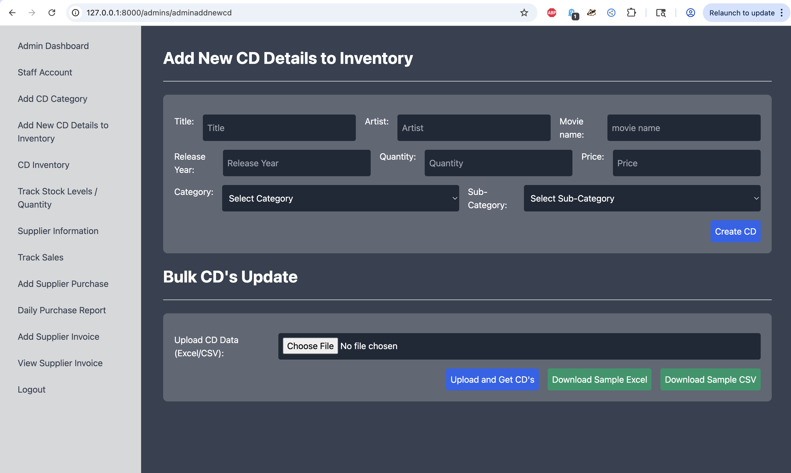
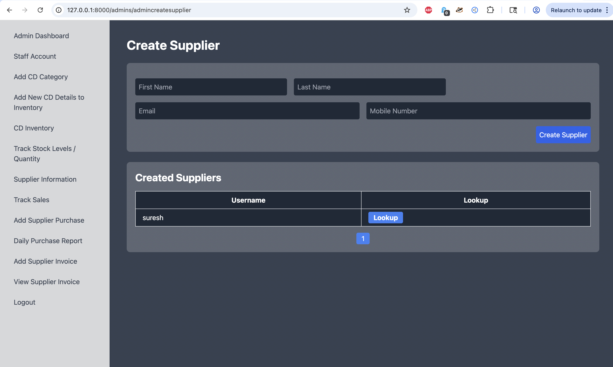
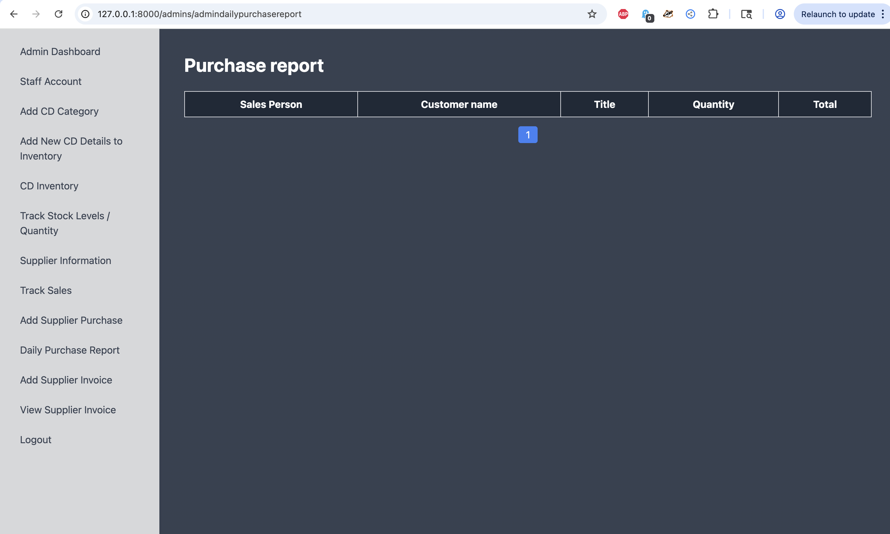
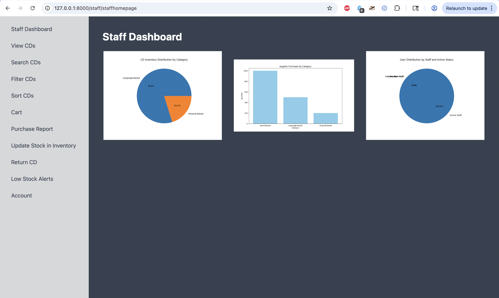
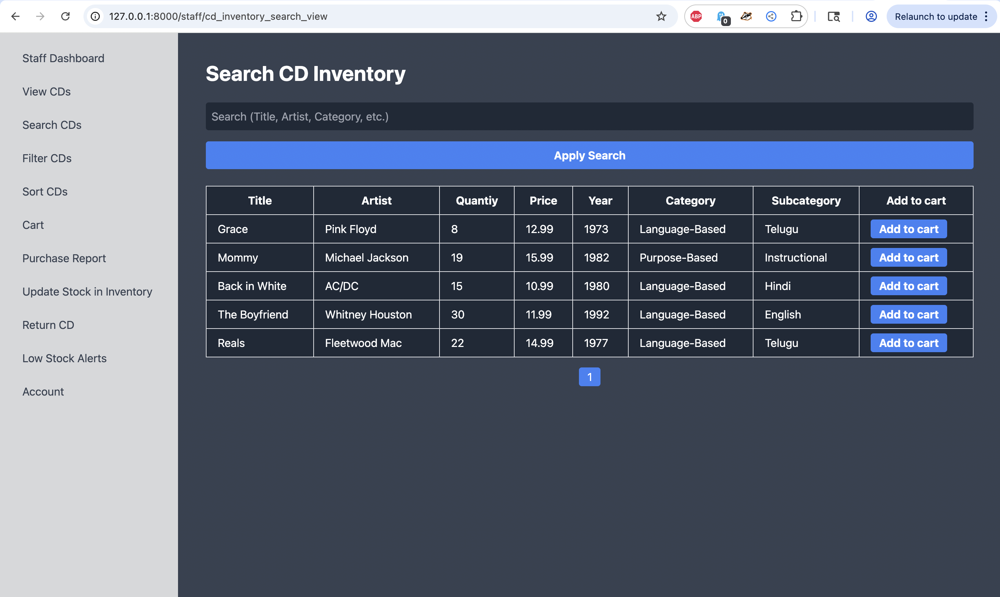
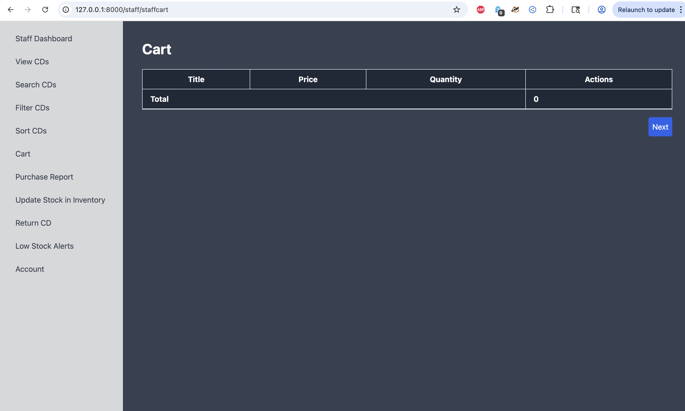
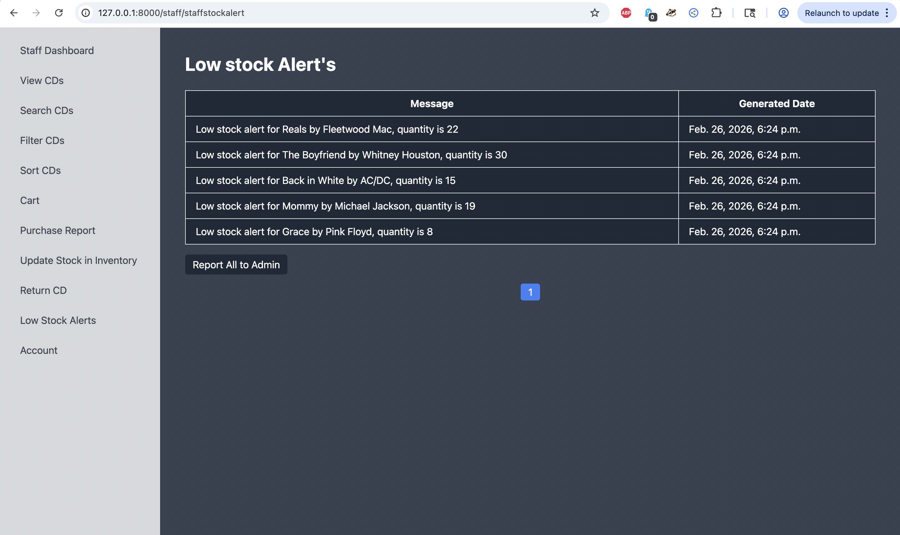

```md
# 🎵 MelodyTrack – Music Inventory Management System
```md


```

MelodyTrack is a **web-based music inventory management system** built with **Python and Django** to help music stores manage large collections of CDs, albums, and music tracks.

It allows **Admins** to manage inventory, suppliers, staff, and reports, while **Staff users** can manage daily inventory operations, sales, and stock tracking.

This project is ideal for learning **Django full-stack development** and inventory management systems.

---

## 🚀 Features

### 🔐 Admin Features
- Admin login & dashboard
- Staff account creation & management
- Add CD categories
- Add new CD details to inventory
- View CD inventory
- Track stock / quantity
- Manage supplier information
- Track sales
- Add supplier purchases
- Daily purchase reports
- Supplier reports
- View supplier invoices

---

### 👨‍💼 Staff Features
- Staff login & dashboard
- View CD inventory
- Search CD inventory
- Filter CD inventory
- Sort CD inventory
- Add items to cart
- Track cart purchases
- Low stock alerts
- Return CDs
- Update stock
- View purchase reports
- Manage staff account details

---

## 🛠️ Tech Stack

**Backend**
- Python
- Django

**Frontend**
- HTML5
- CSS
- JavaScript

**Database**
- SQLite (default Django DB – can be changed to PostgreSQL/MySQL)

---

## 📦 Requirements

- Python 3.8+
- Django 3.x+
- pip

---

## 📂 Project Structure

```md
```
melodytrack/
│
├── backend/
│   ├── manage.py
│   ├── backend/        # Django settings & URLs
│   ├── admins/         # Admin module
│   ├── staff/          # Staff module
│   ├── templates/
│   ├── static/
│   └── ...
│
├── requirements.txt
├── README.md
└── screenshots/
     ├── admin/
     └── staff/
```
```

---

## ⚙️ Installation & Setup

### 1️⃣ Clone the repository
```bash
git clone https://github.com/bellamkondasrikanth66/melodytrack.git
cd melodytrack
````

### 2️⃣ Create virtual environment

```bash
cd backend
python3 -m venv venv
source venv/bin/activate     # Mac/Linux
# OR
venv\Scripts\activate        # Windows
```

### 3️⃣ Install dependencies

```bash
pip install -r ../requirements.txt
```

### 4️⃣ Run migrations

```bash
python manage.py migrate
```

### 5️⃣ Create admin user

```bash
python manage.py createsuperuser
```

### 6️⃣ Run the server

```bash
python manage.py runserver
```

Open in browser:

👉 Home: [http://127.0.0.1:8000/](http://127.0.0.1:8000/)
👉 Admin login: [http://127.0.0.1:8000/admin/](http://127.0.0.1:8000/admin/)
👉 Staff login: [http://127.0.0.1:8000/staffhomepage/](http://127.0.0.1:8000/staff/staffhomepage)
---

## ▶️ Usage

### Admin Workflow

1. Login as admin
2. Create staff accounts
3. Add CD categories
4. Add CDs to inventory
5. Manage suppliers
6. Track sales & purchases
7. View reports & invoices

### Staff Workflow

1. Login as staff
2. View and search inventory
3. Add items to cart
4. Track stock levels
5. Handle CD returns
6. Update stock
7. View purchase reports

---

## 📸 Screenshots

### Admin Portal

```
screenshots/admin/
```

Example:




---

### Staff Portal





```
screenshots/staff/
```

Example:


---

## 🤝 Contributing

Contributions are welcome!

1. Fork the repository
2. Create a branch

   ```
   git checkout -b feature-name
   ```
3. Commit changes

   ```
   git commit -m "Add feature"
   ```
4. Push

   ```
   git push origin feature-name
   ```
5. Open Pull Request

---

## 🧹 Recommended .gitignore

```
.DS_Store
venv/
__pycache__/
*.pyc
db.sqlite3
.env
node_modules/
```

---

## 📄 License

This project is licensed under the **MIT License**.

---

## 👨‍💻 Author

**Srikanth Bellamkonda**
GitHub: [https://github.com/bellamkondasrikanth66](https://github.com/bellamkondasrikanth66)

---

## ⭐ Support

If you like this project, please ⭐ star the repository!
